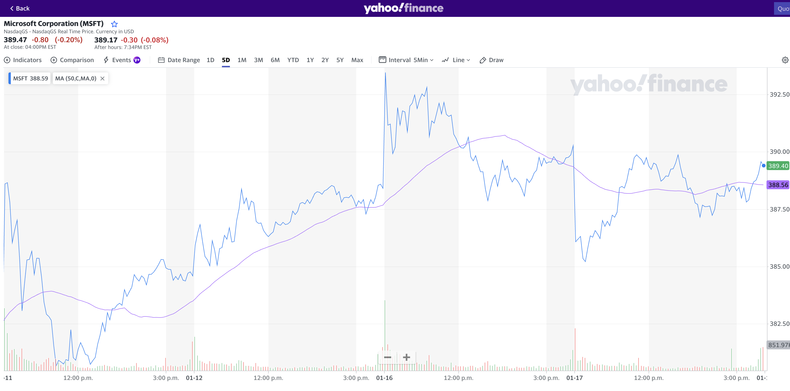

# Introduction to the Stock Market
Welcome!

Are you curious about how the stock market weaves into wealth creation? It starts with learning the basics. This session paves the way to automate our financial analysis—our ultimate aim.

## Understanding the Stock Market
### What is the Stock Market?
Imagine the stock market as a vibrant marketplace where stock shares, which represent partial ownership in a company, as well as other types of financial contracts are traded. Share prices constantly fluctuate like a barometer, reflecting both the health of a company and the broader economic climate.
### Key Factors Influencing Stock Prices
* **Company Performance:** The day-to-day changes in a company's stock price are indicators of its operational success and profitability.
* **Market Sentiment:** The overall 'financial weather' — like inflation, recession, and general investor sentiment — significantly impacts stock prices.
## Analyzing Stock Market Data
### The Basics of Stock Analysis
* **Stock Tickers:** Every company on the stock exchange is assigned a unique ticker symbol. For instance, 'MSFT' is a symbol that signifies a share in Microsoft.
* **Price Trends:** Analyzing stock prices across different timeframes, like weekly, monthly, or yearly, helps us understand performance trends. The chart below shows Microsoft's stock price for a period ending on December 7, 2024. Observe how the blue line indicates the price changes throughout the week.
* **Trade Volume and Volatility:** Stock price volatility is closely tied to the volume of shares traded. This is depicted in the chart, where red and green bars represent daily trading volumes. Green bars indicate days when the stock's closing price was higher than its opening, suggesting a value increase, while red bars show a decrease in value.
* **Indicators:** To better identify long-term trends in financial market analysis and reduce the noise of short-term variations, we utilize different statistical calculations known as financial indicators. For instance, the purple line in the chart depicts the 50-day Moving Average. It shows the average closing price of the stock over the last 50 trading days and as you can see it is noticeably smoother than the blue line.

*<figcaption>
5-Day Microsoft Stock (MSFT) Price History - December 7, 2024
</figcaption>*

* **Stock Portfolio:** A stock portfolio is a collection of stocks selected by investors to meet their financial goals. It's important because it represents an individual's or entity's investment strategy and risk tolerance. Diversifying a portfolio across various stocks or sectors helps mitigate risk while aiming for potential returns.
* **Funds (ETF and Mutual):** ETFs (Exchange-Traded Funds) and mutual funds are investment funds that pool money from many investors to buy a diversified portfolio of stocks, bonds, or other assets. ETFs trade like stocks on an exchange, while mutual funds are bought and sold based on their net asset value. These funds offer investors an easy way to diversify their investments and reduce risk, as they provide exposure to a wide range of assets through a single investment.

## The Limitation of Manual Analysis
Traditional stock analysis, while offering valuable insights, faces inherent limitations due to the extensive calculations required. Frequent updating of charts and data sets becomes impractical, especially when managing a large portfolio of stocks.

## Introducing Data Engineering in Stock Analysis
By utilizing computer coding, we can overcome the limitations of manual analysis and automate our repetitive calculations. Data engineering, the programming discipline focused on efficient data collection and real-time updates, has the potential to transform how we manage large volumes of financial data. It enables the creation of data pipelines to translate vast amounts of information into actionable insights.

## Our Goal: Building a Scalable Data System
Our primary objective in this course is to create a system that:

* Programmatically updates data files on stock prices on a recurrent basis.
* Efficiently handles data for multiple stocks.
* Creates a processing framework for large-scale analysis and prediction.
## Session Overview
In this session, we've laid the foundation for understanding the fundamentals of stock markets. In the data world, comprehending the underlying principles that influence the data we process and analyze is crucial. Arming yourself with **domain knowledge** is key to navigating through the otherwise vast desert of unknown data towards your intended goal. As we move forward, our journey will take us deeper into the more technical realms, encompassing data extraction, processing, and analysis.
