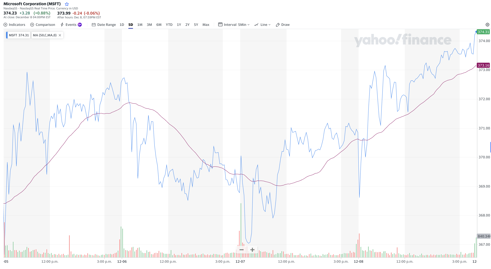

# Introduction to the Stock Market
## Understanding the Stock Market
### What is the Stock Market?
The stock market is a financial institution where individuals and entities trade shares, representing ownership in companies. It acts as a barometer of a company's health and the broader economic climate.
### Key Factors Influencing Stock Prices
* **Company Performance:** The day-to-day changes in a company's stock price reflect its operational success and profitability.
* **Market Sentiment:** The overall 'financial weather' — including factors like inflation, recession, and general investor sentiment — significantly impacts stock prices.
## Analyzing Stock Market Data
### The Basics of Stock Analysis
* **Stock Tickers:** On the stock market, each company is identified by a unique ticker symbol. For example, Microsoft's stock price is denoted as 'MSFT', and each unit of this ticker symbol corresponds to a share of ownership in the company.
* **Price Trends:** When we analyze a stock's price over various timeframes—such as weekly, monthly, or yearly—we gain insights into its performance trends. The chart below illustrates a snapshot of Microsoft's stock price fluctuations on December 7, 2024. The blue line tracks the stock's price movement over the week.
* **Trade Volume and Volatility:** The volume of shares traded can significantly impact a stock's price volatility. In the chart, the red and green bars at the bottom denote the trading volume - the number of shares traded - for each day. A green bar represents a day when the closing price was higher than the opening price, indicating an increase in value. Conversely, a red bar indicates a decrease in value, with the closing price lower than the opening price.
* **Indicators:** To better identify long-term trends in financial market analysis and reduce the noise of short-term variations, we utilize different statistical calculations known as financial indicators. For instance, the purple line in the chart depicts the 50-Day Moving Average. It shows the average closing price of the stock over the last 50 trading days and as you can see it is noticeably smoother than the blue line.

<figcaption>
Figure 1: Microsoft Stock (MSFT) Price Chart on December 7, 2024
</figcaption>

* **Stock Portfolio:** A stock portfolio is a collection of stocks chosen by an investor to meet their financial goals. It's important because it represents an individual's or entity's investment strategy and risk tolerance. Diversifying a portfolio across various stocks or sectors helps mitigate risk while aiming for potential returns.
* **Funds (ETF and Mutual):** ETFs (Exchange-Traded Funds) and mutual funds are types of investment funds that pool money from many investors to buy a diversified portfolio of stocks, bonds, or other assets. ETFs trade like stocks on an exchange, while mutual funds are bought and sold based on their net asset value. These funds offer investors an easy way to diversify their investments and reduce risk, as they provide exposure to a wide range of assets through a single investment.

## The Limitation of Manual Analysis
While traditional stock analysis offers valuable insights, it's inherently limited in scope and scalability. Analyzing stocks individually and updating data frequently is time-consuming and not feasible for large-scale analysis.

## Introducing Data Engineering in Stock Analysis
To address these limitations, we turn to data engineering. It offers a scalable solution to automate data collection, update information in real-time, and analyze multiple stocks simultaneously.

## Our Goal: Building a Scalable Data System
Our primary objective in this course is to create a system that:

* Automatically updates stock data daily.
* Handles data for multiple stocks efficiently.
* Provides a framework for large-scale analysis and prediction.
## Session Overview
In this session, we've stablished the groundwork for understanding the stock market's fundamentals. In the world of data, it is crucial to understand the behaviour of the data we are processing and analyzing. It is called **"domain knowledge"** and it is essential to prevent aimless wandering through the vast desert of unknown data. As we progress, we will delve into the more technical aspects of our work, including data extraction, processing, and analysis.